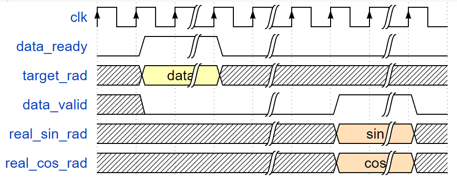
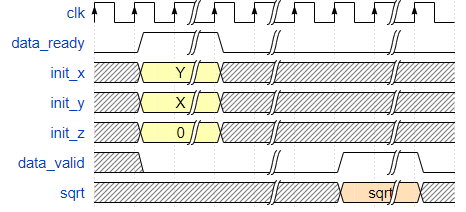

# Some MathFunction With Verilog
## 概述  
这里面用`veilog`实现了一些数学算法，因为***Xilinx***的IP核接口是***AXI4***的没办法，我只好自己重写。  

---

## 目前进展
- 旋转模式的**CORDIC**算法，基于流水线结构。(2022.4.10)  
- 向量模式的**CORDIC**算法，基于流水线结构。(2022.4.17)  
    
---
  
## 文件结构
- `cordic_trig->cordic_trig_pp.v`：基于流水线结构的旋转模式**CRODIC**算法。
- `cordic_trig->cordic_iterate.v`：**CORDIC**旋转模式中的单个迭代结构。  
- `cordic_sqrt->cordic_vect_pp.v`：基于流水线模结构的向量模式**CRODIC**算法。
- `cordic_sqrt->cordic_iterate.v`：**CORDIC**向量模式中的单个迭代结构。  

---

## 时序说明
1. **cordic_trig_pp.v**：  
   当`data_ready`拉高时，表示输入数据有效，模块计算完成后会自动拉高`data_valid`同时输出sin和cos。若有多组数据需要计算，可将`data_ready`保持高，直到数据输入数据结束即可。  
  
1. **cordic_vect_pp.v**：  
   当`data_ready`拉高时，表示输入数据有效，模块计算完成后会自动拉高`data_valid`同时输出sqrt。若有多组数据需要计算，可将`data_ready`保持高，直到数据输入数据结束即可。  
  

---

## 备注
使用**CORDIC**算法时，用到了我自己写的[标准D触发器](https://github.com/WeChatTeam/StandardDFF.git)。